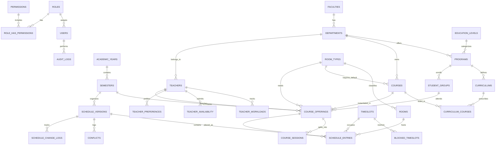

# Entity Relationship (ER) Diagram & Schema Specification

## Relational Constraints & Rules
- **Course Offering to Schedule Entry**: 1 Offering produces $N$ discrete session entries (e.g. 4 hours split into $2 + 2$ consecutive periods).
- **Cascade Deletes**:
  - Soft deletes on Master Data (`courses`, `teachers`, `rooms`, `student_groups`) preserve historic schedules.
  - Cascades apply only on transient/child entries (`schedule_entries`, `conflicts` when a version is deleted).
- **Immutability of Published Schedules**:
  - When `schedule_versions.status = 'published'`, updates are rejected. A new `draft` version must be branched.
